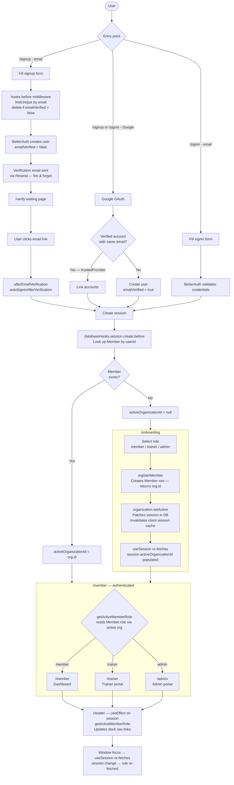

# Application Flow

## Auth, Onboarding & Role-based Routing

## Key Invariants

| Concern | Mechanism |
|---|---|
| Account pre-emption | `hooks.before` deletes unverified duplicate before BetterAuth's own email uniqueness check |
| Email uniqueness | `@unique` on `User.email` — safe because the hook guarantees at most one row per email |
| OAuth + email/pw same account | `accountLinking.trustedProviders: ["google"]` auto-links on sign-in |
| Role not visible after signup | `organization.setActive()` in onboarding patches `activeOrganizationId` on the live session |
| Stale role in Header | `useSession` refetches on window focus → triggers `getActiveMemberRole` via `useEffect` |
| Prerender failures | `force-dynamic` on pages that call `headers()` via `getSession()` |
